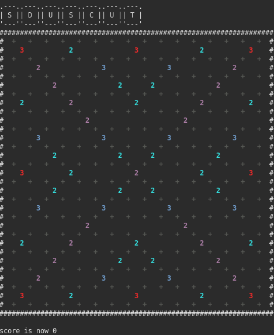
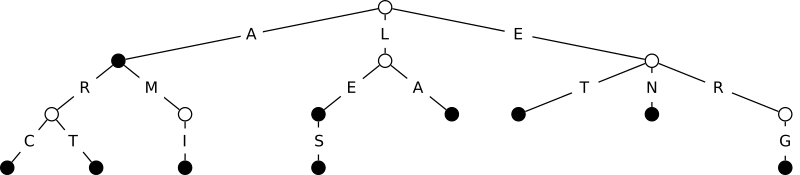

# Projet Scrabble

## Introduction

Le but de ce projet est la programmation d'un joueur automatique au scrabble,
qui déterminera le coup rapportant le plus de points étant donné un plateau de
jeu, l'ensemble des lettres du joueur, et un dictionnaire. Vous pourrez
retrouver les règles du jeu et des tutoriels [facilement sur le
web](https://duckduckgo.com/?q=scrabble+how+to+play&t=h_&ia=web).

Ce projet s'appuie sur la structure de
[GADDAG](https://en.wikipedia.org/wiki/GADDAG) qui permet de déterminer
efficacement étant donné un point de départ sur le plateau les mots qui peuvent
être ajoutés en passant par ce point. Votre rôle consistera à implémenter une
version simplifiée de cette structure, puis de la mettre en œuvre pour chercher
le meilleur coup.



## Dépôt de base

Ce dépôt constitue une base pour votre projet. Vous y trouverez le nécessaire
pour créer un plateau de jeu vierge, en charger un depuis un fichier, le remplir
et l'afficher. **Vous n'êtes pas obligés d'utiliser ce dépôt**. Libre à vous de
vous créer votre propre code de zéro si vous le préférez, ou de modifier le code
fourni autant que vous le souhaitez pour correspondre à vos besoins. L'important
reste néanmoins que vous rendiez un travail qui soit compilable et lisible par
votre encadrant.

La compilation de ce dépôt se fait à l'aide de `premake`, qui vous permet de
générer à la fois un Makefile, ou un projet codeblocks. Premake est déjà
installé sur les machines en salles de TP, et des paquets sont disponibles pour
la plupart des distributions linux. Pour générer des projets codeblocks, la
version 4 est nécessaire [à télécharger
ici](https://premake.github.io/download.html#v4) si elle n'est pas disponible
sur votre système. Il est normalement également possible de générer des projets
Visual Studio et Xcode.

La configuration de Premake est réalisée dans le fichier `premake4.lua`. Vous y
trouverez en commentaire comment ajouter de nouveaux fichiers à votre projet, et
comment compiler de multiples exécutables.

### Générer un Makefile (premake 4 ou 5)
```
premake4 gmake
```

Une fois le `Makefile` créé, utilisez make comme d'habitude pour lancer la
compilation.

### Générer un projet Codeblocks (premake 4 uniquement)
```
premake4 codeblocks
```

Une fois le projet généré, ouvrez le fichier `.workspace` dans Codeblocks, et
vous pourrez travailler.

## Gestion du joueur

Votre première tâche consiste à mettre en place le nécessaire pour qu'un joueur
puisse jouer. Vous devez pour celà créer des structures de données pour
matérialiser le sac des lettres et les lettre possédées par les joueurs. Vous
fournirez aussi également des fonctions pour obtenir rapidement le nombre de
points correspondant à une lettre.

En français, le sac de lettres contient initialement les lettres avec les points
suivants :

|      | A | B | C | D | E | F | G | H | I | J | K | L | M |
|------|---|---|---|---|---|---|---|---|---|---|---|---|---|
|Nombre| 9 | 2 | 2 | 3 | 15| 2 | 2 | 2 | 8 | 1 | 1 | 5 | 3 |
|Points| 1 | 3 | 3 | 2 | 1 | 4 | 2 | 4 | 1 | 8 | 10| 1 | 2 |

|      | N | O | P | Q | R | S | T | U | V | W | X | Y | Z |
|------|---|---|---|---|---|---|---|---|---|---|---|---|---|
|Nombre| 6 | 6 | 2 | 3 | 6 | 6 | 6 | 6 | 2 | 1 | 1 | 1 | 1 |
|Points| 1 | 1 | 3 | 2 | 1 | 1 | 1 | 1 | 4 | 10| 10| 10| 10|

**Notez que pour l'instant, on ne traite pas les jokers qui pourront être
ajoutés en bonus.**

### Sac de lettres

Créez une structure de données matérialisant le sac de lettres. Cette structures
sera initialisée avec les lettres dans les quantités données ci-dessus. Cette
structure devra permettre de pouvoir facilement piocher une lettre au hasard
parmis les lettres restantes, c'est à dire que chaque lettre a une probabilité
de tirage proportionnelle au nombre d'exemplaires restant dans le sac. 

En terme de complexité, une structure bien réalisée devra permettre de piocher
une lettre en temps constant.

### Lettres du joueur

Créez une structure de données pour matérialiser les lettre d'un joueur. Sauf
quand il n'y en a plus dans le sac pur recharger, un joueur a toujours 7 lettres
à sa disposition. Votre structure devra être adaptées à l'exploration que vous
ferez par la suite des mots qui sont jouable sur un plateau. Prévoyez également
de pouvoir recharcger les lettres d'un joueur depuis le sac de lettres.

### Points des lettres

Fournissez une fonction qui étant donné une lettre fournit le nombre de points
associés.

## GADDAG

Le Gaddag simplifié est une structure de données pour encoder le dictionnaire,
et déterminer rapidement si des mots sont dedans ou non. Nous simplifions ici
cette structure de données pour faciliter son implémentation, en retirant la
minimisation du nombre de nœuds. Votre Gaddag sera dont plus simplement un
arbre.

### Arbre dictionnaire

#### Principe

Un arbre dictionnaire est un arbre dans lequel les arêtes sont étiquetées par
des lettres, et les nœuds sont doté d'un marqueur indiquant s'ils sont
terminaux ou non. Étant donné un mot, on débute la recherche à la racine. Pour
chaque lettre du mot, on avance le long de l'arête portant cette lettre vers un
enfant. La recherche se termine dès qu'il n'y a pas d'arête étiquetée avec la
lettre souhaitée, ou lorsqu'il n'y a plus de lettres dans le mot, on peut alors
vérifier :

* s'il n'y avait pas d'arête pour une lettre, le mot n'est pas dans le
  dictionnaire ;
* le mot est dans le dictionnaire si et seulement si le nœud sur lequel le
  parcours a abouti est terminal.

Par exemple, sur l'arbre suivant, sur lequel les nœuds terminaux xont colorés en
noir :



Le mot `AMI` est dans le dictionnaire car en partant de la racine, puis en suivant
les arêtes `A` puis `M` puis `I` on arrive sur un nœud terminal. Plus
généralement, les mots reconnus par cet arbre sont `A`, `ARC`, `ART`, `AMI`,
`LE`, `LES`, `LA`, `ET`, `EN`, `ERG`

Le mot `LAS` n'est pas dans le dictionnaire, car après avoir suivi les arêtes
correspondant aux premières lettres `LA` , on aboutit sur un nœud depuis lequel
aucune arête ne part correspondant à la lettre `S`.

Le mot `AM` n'est pas dans le dictionnaire car après avoir suivi les arêtes
correspondant à toutes ses lettres, on aboutit à un nœud qui n'est pas terminal.

#### Insertion

Étant donné un mot à ajouter, le principe consiste à itérer sur les lettres du
mot dans l'ordre de gauche à droite, et à suivre le chemin correspondant dans
l'arbre. Si aucune arête n'existe pour correspondre à une lettre, de nouvelles
arêtes vers de nouveaux nœuds sont créées. Le dernier nœud créé est marqué comme
terminal. Si toutes les arêtes existent, le nœud sur lequel on arrive est marqué
comme terminal.

#### Recherche

La recherche consiste à suivre le chemin dans l'arbre, et à vérifier au fur et à
mesure qu'on peut continuer, puis que le nœud final sur lequel on est arrivé est
bien terminal.

#### Liste de mots

Vous trouverez la liste des mots actuellement autorisés au Scrabble dans le
fichier [data/dico.txt](data/dico.txt).

### Rechercher des mots par le milieu, le Gaddag

Les arbres dictionnaires ne sont pas totalement adaptés pour le Scrabble, car
lorsqu'on cherche à ajouter un mot, il faut l'ajouter à partir des lettres déjà
présentes sur le plateau. On identifie donc une case à partir de laquelle
construire notre mot de part et d'autre, verticalement ou horizontalement. Dans
l'exemple suivant, le mot `BATEAU` est placé en travers du mot `BLATTE` :

```
        B
        L
        A
    B A T E A U
        T
        E
```

Pour permettre de chercher des mots *en partant du milieu*, nous allons rajouter
une nouvelle lettre `+`, et pour chaque mot du dictionnaire nous allons créer un
ensemble de mots selon le modèle suivant : pour le mot initial `BATEAU`, nous
allons créer l'ensemble :

```
B+ATEAU
AB+TEAU
TAB+EAU
ETAB+AU
AETAB+U
UAETAB+
```

Avant le `+`, les premières lettres du mot sont renversées, et après le `+` on
retrouve la fin normale du mot.

À partir de la lettre `T` du mot `BLATTE`, on peut chercher dans notre
dictionnaire les mots pouvant se mettre en travers, en suivant un chemin
commençant par `T`. On trouve `TAB+EAU`, ce qui signifie qu'en partant de `T` et
en allant vers la gauche, on peut rajouter `A` puis `B`, ensuite le `+` nous
indique de revenir au `T` initial et de partir vers la droite, pour rajouter les
lettres `E` puis `A`, puis `U`.

Modifiez donc votre arbre dictionnaire pour faire en sorte que pour chaque mot
du dictionnaire, l'ensemble de mots créé avec le `+` selon le modèle précédent
soit ajouté.

## Exploitation du Gaddag

Explications à venir

## Jeu de test

Explications à venir

## Bonus

Explications à venir
